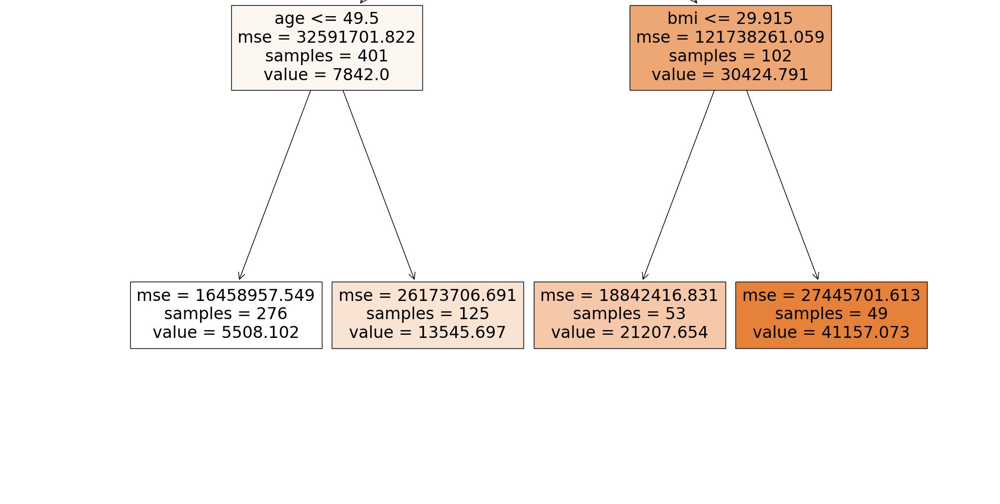
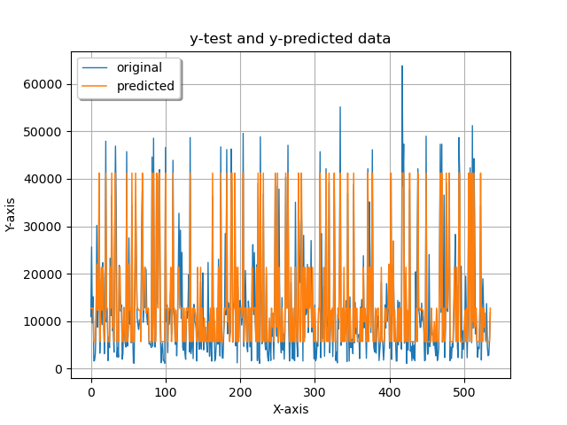

# machine-learning-random-forest

## Random forest for a regression problem which predicts medical cost

## Procedure
First we import the necessary libraries (pandas for reading and performing
operations on dataset and sklearn library for random forest regressor and
encoding functions and matplotlib and seaborn for plotting graphs.
### Importing libraries

import pandas as pd
import numpy as np
from sklearn.ensemble import RandomForestRegressor
import matplotlib.pyplot as plt

### Importing [dataset](https://www.kaggle.com/datasets/mirichoi0218/insurance)
```
data = pd.read_csv('./insurance.csv')
```

### findout features

We find out the no. of features and no. of rows in the dataset and type of each
feature (numerical or categorical) and assign target variable for regression.
```
print(data.head())
print("\n\n")
print(data.shape)
print("\n\n")

# any null values?
print(data.isnull().sum())
print("\n\n")
```

```

   age     sex     bmi  children smoker     region      charges
0   19  female  27.900         0    yes  southwest  16884.92400
1   18    male  33.770         1     no  southeast   1725.55230
2   28    male  33.000         3     no  southeast   4449.46200
3   33    male  22.705         0     no  northwest  21984.47061
4   32    male  28.880         0     no  northwest   3866.85520


(1338, 7)

age         0
sex         0
bmi         0
children    0
smoker      0
region      0
charges     0
dtype: int64

```
There are seven features in this dataset:
age
sex
bmi
children
smoker
region
charges

### encoding  categorical to numerical
Here, sex, smoker and region are not numerical values.
we encode these categorical values using label encoder.
```
from sklearn import preprocessing
le = preprocessing.LabelEncoder()
data['sex'] = le.fit_transform(data['sex'])
data['smoker'] = le.fit_transform(data['smoker'])
data['region'] = le.fit_transform(data['region'])

data.head(5)
```
#assigning target variable charges to X

We assign target variable as charges.
```
X = data.drop('charges',axis=1)
y = data['charges']
```
### Splitting of data

Now, split the dataset in 60:40 for testing and training.
```
from sklearn.model_selection import train_test_split
from sklearn.preprocessing import StandardScaler

X_train, X_test, y_train, y_test = train_test_split(X, y, test_size = 0.40, random_state = 20)
```

### Regression model

We use random forest regressor and set no of trees to be 150 and max no of leaf
nodes as 4.


```
from sklearn.ensemble import RandomForestRegressor
regressor = RandomForestRegressor(n_estimators = 150,max_leaf_nodes=4, random_state = 30)
regressor.fit(X_train, y_train)
y_pred = regressor.predict(X_test)
print(y_pred)
print("\n\n")
print("Regression Score:\n")
print(regressor.score(X_test,y_test))
print("\n\n")
```
```
Regression Score:

0.838405079721362
```

### Metrics,mse
finally we predict charges using rf regression and find out RMSE, MAE, MSE
the performance metrics for this regression.
```
from sklearn import metrics
print('Mean Absolute Error(MAE):', metrics.mean_absolute_error(y_test, y_pred))
print('Mean Squared Error(MSE):', metrics.mean_squared_error(y_test, y_pred))
print('Root Mean Squared Error(RMSE):', np.sqrt(metrics.mean_squared_error(y_test,y_pred)))
```
```
Mean Absolute Error(MAE): 3257.1768980181223
Mean Squared Error(MSE): 24799316.583901435
Root Mean Squared Error(RMSE)
```
### Random forest
```
from sklearn import tree
plt.figure(figsize=(20,20))
_ = tree.plot_tree(regressor.estimators_[0], feature_names=X.columns,filled=True)
plt.show()
```

### Plotting graph
```
x_ax = range(len(y_test))
plt.plot(x_ax, y_test, linewidth=1, label="original")
plt.plot(x_ax, y_pred, linewidth=1.1, label="predicted")
plt.title("y-test and y-predicted data")
plt.xlabel('X-axis')
plt.ylabel('Y-axis')
plt.legend(loc='best',fancybox=True, shadow=True)
plt.grid(True)
plt.show() 
```

